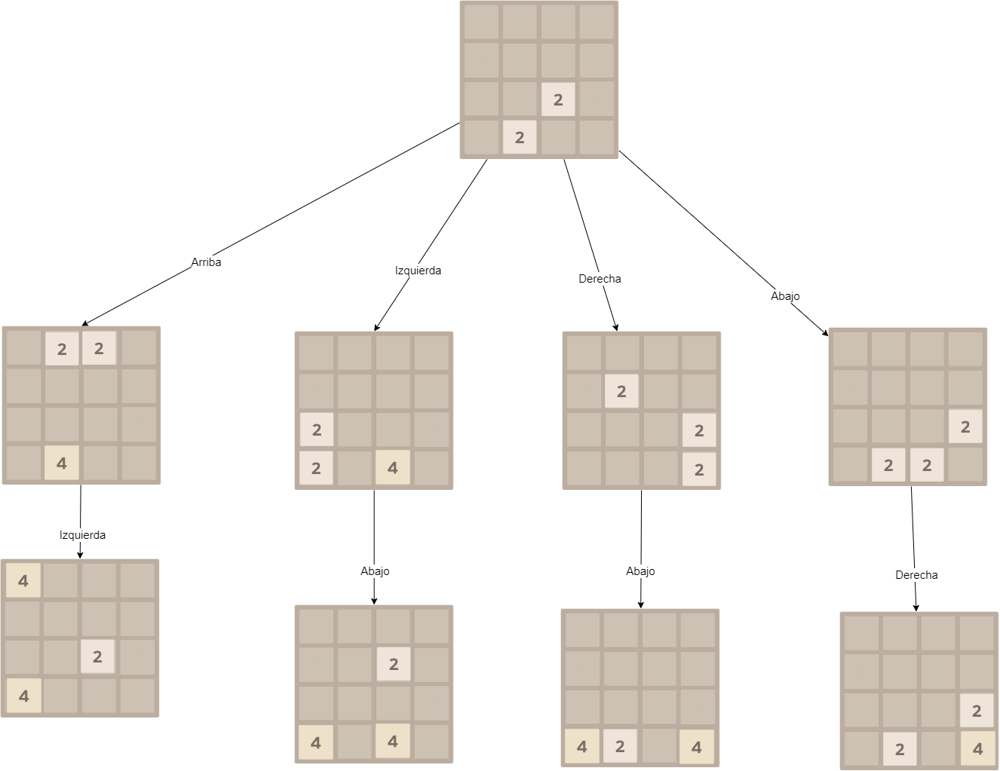

# SVRAI
En este repositorio, se encuentran los ejercicios relativos a la asignatura SVRAI (Síntesis, Verificación y Razonamiento sobre Agentes Inteligentes) del máster MULCIA
(Máster Universitario en Lógica, Computación e Inteligencia Artificial).

Para la resolución de los ejercicios, hay un fichero independiente para cada uno en el que se encuentra el modelado del mismo y finalmente, en el archivo general.py, 
se encuentran los algoritmos con los que se va a trabajar para la ejecución de los mismos. 
En este fichero, se encuentran los distintos algoritmos para cada ejercicio y la generación del entorno de los mismos, por lo que para la ejecución de los algoritmos habrá que pasar por parámetros el ejercicio sobre el que se quiere ejecutar.

Los problemas escogidos son los siguientes:
 
## Ejercicio 1. Vehículo en pendiente
Para el primer ejercicio, se cuenta con 3 estados distintos, siendo estos Bajo, Medio y Alto y con dos acciones: girar ruedas (sube un estado) o no girar ruedas(baja un estado). El modelo de Markov para este problema es el siguiente:
 

## Ejercicio 2. Vehículo en pendiente con probabilidades
Este ejercicio, es igual que el anterior con la única diferencia de que cuenta con probabilidades de que se realicen las acciones y contiene un estado más. Las acciones, funcionan de esta forma:
- Giro rápido: Sube la pendiente con probabilidad de 0.7 y baja al estado "bajo" con probabilidad de 0.3. Consume 2 unidades de energía (recompensa = -2)
- Giro lento: Sube la pendiente con probabilidad de 0.3 y baja al estado "bajo" con probabilidad de 0.7. Consume 1 unidad de energía (recompensa = -1)
El modelo de markov es el siguiente:
 

## Ejercicio 3. Mundo Malla
Para este problema, se considera cada casilla como un estado, es decir:
 
De esta forma, habrá 4 estados que tengan una recompensa asociada y para moverse con las acciones.  
Para las acciones, existen las siguientes probabilidades:
- 0.7 de realizar la acción deseada
- 0.1 de realizar otra acción de las 3
- 0.1 de realizar otra acción de las 3
- 0.1 de realizar la última acción restante de las 3

Un ejemplo de diagrama de estados sería:

## Ejercicio 4. 2048
Este ejercicio, sigue las reglas del 2048 original. En nusetro caso, un estado será una distribución del tablero concreta y las acciones posibles, serán mover arriba, abajo, derecha o izquierda. El funcionamiento es el siguiente: 

 
Un ejemplo de ejecución con los estados, sería el siguiente (en este caso únicamente se han puesto estados simbólicos, ya que al contar con la incertidumbre de la generación de una nueva ficha, se pueden generar muchos estados distintos para una misma acción): 

 
Finalmente, de este ejercicio únicamente se ha realizado el modelado, debido a que por falta de tiempo, no se ha conseguido implementar Monte Carlo Tree Search, que sería uno de los algoritmos apropiados para este tipo de problemas con incertidumbre.
